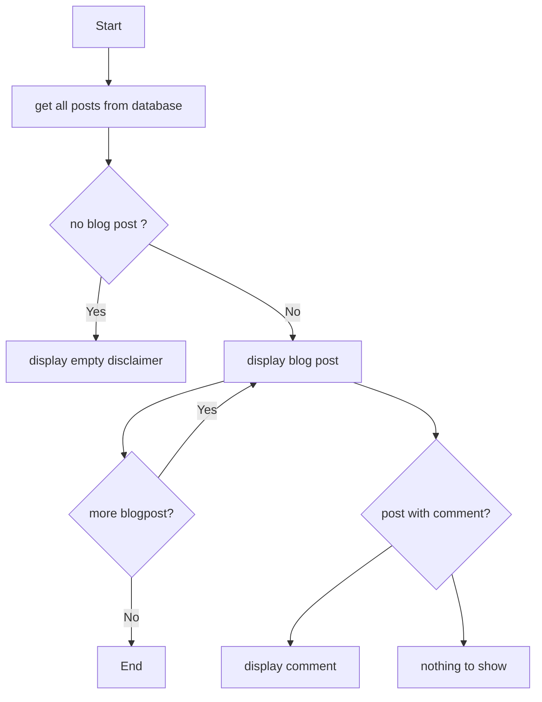
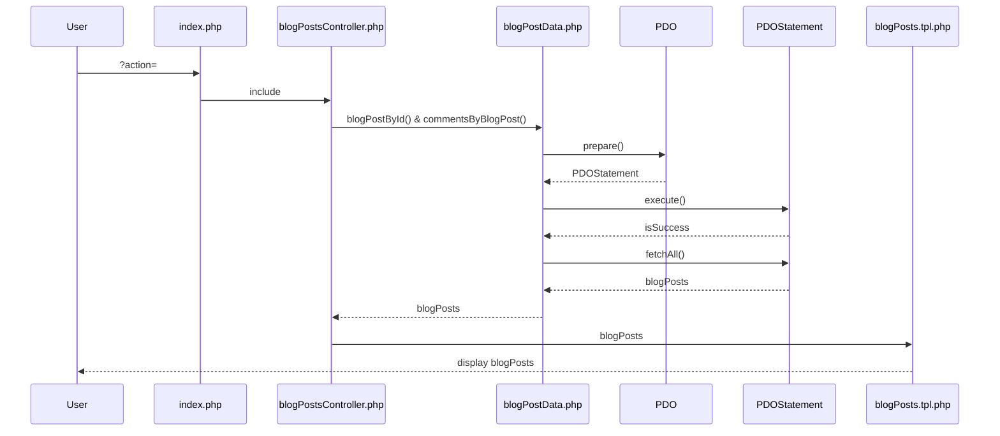

```mermaid
flowchart TD
A[Start] --> B[get all posts from database]
B --> C{no blog post ?}
C -- Yes --> D[display empty disclaimer]
C -- No --> E[display blog post]
E --> F{more blogpost?}
E --> H{post with comment?}
H --> Yes[display comment]
H --> No[nothing to show]
F -- Yes --> E
F -- No --> G[End]
```

```mermaid
sequenceDiagram
User->>index.php: ?action=
index.php->>blogPostsController.php: include
blogPostsController.php->>blogPostData.php: blogPostById() & commentsByBlogPost()
blogPostData.php->>PDO: prepare()
PDO-->>blogPostData.php: PDOStatement
blogPostData.php->>PDOStatement: execute()
PDOStatement-->>blogPostData.php: isSuccess
blogPostData.php->>PDOStatement: fetchAll()
PDOStatement-->>blogPostData.php: blogPosts
blogPostData.php-->>blogPostsController.php: blogPosts
blogPostsController.php->>blogPosts.tpl.php: blogPosts
blogPosts.tpl.php-->>User: display blogPosts
```

